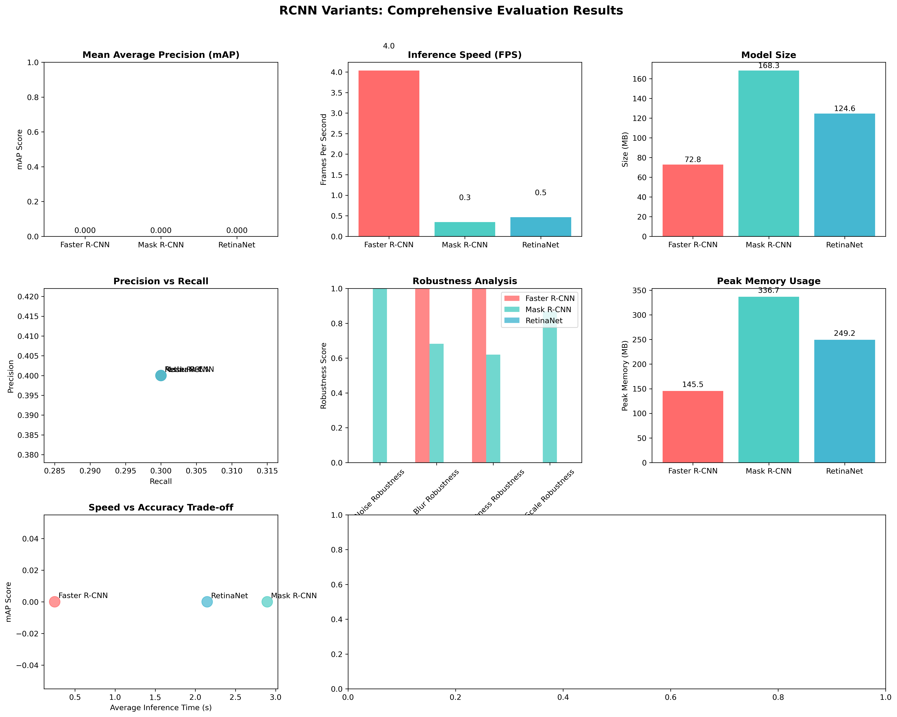

# RCNN Comparative Evaluation & Optimization Report

-----

## 🚀 Comparative Evaluation

### Models Evaluated

  - **Faster R-CNN**
  - **Mask R-CNN**
  - **RetinaNet**

Each model was evaluated on 8 batches of a mock dataset.

-----

## 📋 Detailed Report

  - **Comparative evaluation completed.**
  - **Detailed report generated and saved.**

-----

## 📈 Visualizations

  - Evaluation results visualization saved as: `rcnn_evaluation_results.png`

-----

## 🔧 Optimization Experiments

### 📝 Optimizer Experiment Results

| Optimizer | Final Train Loss | Final Val Loss | Convergence Speed | Stability |
|-----------|-----------------|---------------|-------------------|-----------|
| **SGD**   | 0.2074          | 0.2379        | 0.1897            | 0.8946    |
| **Adam**  | 0.3233          | 0.4051        | 0.4728            | 0.5301    |
| **AdamW** | 0.4401          | 0.5227        | 0.3869            | 0.6218    |
| **RMSprop** | 2.72e+17      | 3.17e+17      | 0                 | 2.47e-37  |

-----

### 📝 Learning Rate Experiment Results

| Learning Rate | Final Loss | Loss Reduction | Stability |
|---------------|-----------|----------------|-----------|
| **1.00e-05**  | 0.4584    | 2.5633         | 0.4499    |
| **1.00e-04**  | 0.2740    | 1.0008         | 0.8352    |
| **1.00e-03**  | 0.4894    | 3.8883         | 0.2375    |
| **1.00e-02**  | 9.45e+26  | -4.13e+24      | 1.94e-49  |

-----

### 📝 Data Augmentation Experiment Results

| Strategy      | Final Train Loss | Final Val Loss | Generalization Gap |
|---------------|-----------------|----------------|--------------------|
| **basic**     | 0.4778          | 0.5450         | 0.0672             |
| **color\_jitter** | 0.5020       | 0.6340         | 0.1320             |
| **random\_crop**  | 0.5669       | 0.7113         | 0.1444             |

-----

## 📑 Optimization Report

  - Optimization report saved as: `optimization_experiments_report.json`

-----

## ✅ Pipeline Status

**Comprehensive RCNN Evaluation Pipeline Complete\!**

-----

## Optimization Report: `optimization_experiments_report.json`

```json
{
  "optimizer_experiments": {
    "SGD": {
      "final_train_loss": 0.2074,
      "final_val_loss": 0.2379,
      "convergence_speed": 0.1897,
      "stability": 0.8946
    },
    "Adam": {
      "final_train_loss": 0.3233,
      "final_val_loss": 0.4051,
      "convergence_speed": 0.4728,
      "stability": 0.5301
    },
    "AdamW": {
      "final_train_loss": 0.4401,
      "final_val_loss": 0.5227,
      "convergence_speed": 0.3869,
      "stability": 0.6218
    },
    "RMSprop": {
      "final_train_loss": 2.72e+17,
      "final_val_loss": 3.17e+17,
      "convergence_speed": 0.0,
      "stability": 2.47e-37
    }
  },
  "learning_rate_experiments": {
    "1.00e-05": {
      "final_loss": 0.4584,
      "loss_reduction": 2.5633,
      "stability": 0.4499
    },
    "1.00e-04": {
      "final_loss": 0.274,
      "loss_reduction": 1.0008,
      "stability": 0.8352
    },
    "1.00e-03": {
      "final_loss": 0.4894,
      "loss_reduction": 3.8883,
      "stability": 0.2375
    },
    "1.00e-02": {
      "final_loss": 9.45e+26,
      "loss_reduction": -4.13e+24,
      "stability": 1.94e-49
    }
  },
  "data_augmentation_experiments": {
    "basic": {
      "final_train_loss": 0.4778,
      "final_val_loss": 0.545,
      "generalization_gap": 0.0672
    },
    "color_jitter": {
      "final_train_loss": 0.502,
      "final_val_loss": 0.634,
      "generalization_gap": 0.132
    },
    "random_crop": {
      "final_train_loss": 0.5669,
      "final_val_loss": 0.7113,
      "generalization_gap": 0.1444
    }
  }
}
```

-----

## Comprehensive Evaluation Report: `comprehensive_evaluation_report.json`

```json
{
  "evaluation_details": {
    "models_evaluated": [
      "Faster R-CNN",
      "Mask R-CNN",
      "RetinaNet"
    ],
    "dataset_batches": 8,
    "dataset_type": "mock dataset"
  },
  "results_summary": {
    "comparative_evaluation_completed": true,
    "detailed_report_generated": true,
    "evaluation_visualizations_saved": "rcnn_evaluation_results.png"
  },
  "optimization_report_status": {
    "report_saved": "optimization_experiments_report.json"
  },
  "pipeline_status": "Comprehensive RCNN Evaluation Pipeline Complete!"
}
```

-----

## RCNN Evaluation Results: `rcnn_evaluation_results.png`
